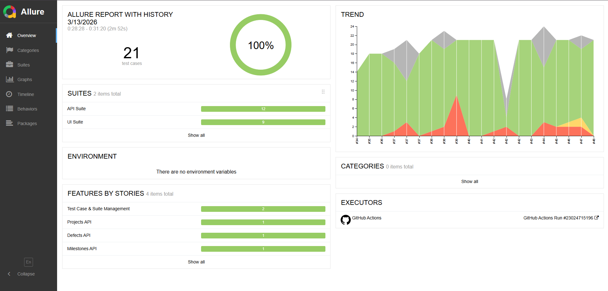

# Test Automation Framework for [Qase.io](https://app.qase.io/)


# [](https://github.com/f0stery/QASE_QA/actions/workflows/QASE.yml)

## Project Goal
Project for test automation of key scenarios for the Qase.io web application using modern Java tools. The project is structured for easy maintenance and scalability.

## Technology Stack
| Category              | Technologies Used                     |
|-----------------------|---------------------------------------|
| Test Framework        | TestNG, Selenide, REST Assured        |
| Programming Language  | Java 17                               |
| Build Tool            | Maven                                 |
| CI/CD                 | GitHub Actions                        |
| Reporting             | Allure Reports                        |
| Utilities             | Lombok, Log4j2                        |

##  Key Features
*   **Page Object & Page Factory:** UI tests are built using the Page Object pattern to minimize code duplication and simplify maintenance when the UI changes.
*   **Data-Driven Approach:** Test data is externalized into property files, separating it from test logic for better flexibility.
*   **Logging & Reporting:** Detailed logging with Log4j2. Comprehensive Allure reports with attachments (screenshots of failures, request logs) are generated after each test run.

## Sample report Allure


*Allure main report page with overall metrics*


*Allure test details page*

##  Project Structure

```
QASE_QA/
├── .github/
│   └── workflows/                          D
├── src/
│   ├── test/
│   │   └── java/
│   │       └── [your-base-package]/
│   │           ├── adapters/              
│   │           ├── models/                 
│   │           ├── pages/                  
│   │           ├── steps/                  
│   │           ├── tests/                 
│   │           │   └── api/
│   │           │   └── ui/
│   │           ├── utils/                  
│   │           └── wrappers/               
│   │
│   └── resources/                          
│           ├── allure.properties           
│           ├── api-suite.xml              
│           ├── config.properties          
│           ├── full-suite.xml              
│           ├── log4j2-test.yaml            
│           └── ui-suite.xml                
├── pom.xml                                 
└── README.md                               
```
##  Getting Started

### Prerequisites
*   Java 17 (or higher)
*   Maven
*   Git

### Installation & Test Execution
1.  **Clone the repository:**
    ```bash
    git clone https://github.com/f0stery/QASE_QA.git
2.  **Navigate to the project directory:**
    ```bash
    cd QASE_QA
3. **Run all tests:**
    ```bash
    cd mvn clean test
4. **Run UI tests in a specific browser (e.g., Chrome)**
    ```bash
   mvn clean test -Dbrowser=chrome
5. **Generate and open the Allure report:**
    ```bash
    mvn allure:serve
   
# Test Coverage

## 🖥 **UI Tests**

### 1. **Projects Management**
- Create new project
- Search project by name/filters
- Edit project
- Remove project

---

### 2. **Project Repository**
#### Test Suites
- Create new suite
- Search suites
- Edit suite
- Remove suite

#### Test Cases
- Create new test case
- Edit test case steps
- Delete test case
- Assign tags to test cases

---

### 3. **Shared Steps**
- Create template steps
- Search shared steps
- Edit template steps
- Delete templates

---

### 4. **Test Plans**
- Create test plan
- Add cases to plan
- Configure execution parameters
- Delete test plan

---

### 5. **Test Runs**
- Start new test run
- Assign executors
- Execute test cases:
    - Pass/Fail statuses
    - Add comments
- Report defects
- Complete test run
- Export results

---

## ⚙️ **API Tests**
### **Defect Management**
- `GET` — Get all defects
- `POST` — Create a new defect
- `DELETE` — Delete defect
- `UPDATE` — Update defect

### **Milestones Management**
- `GET` — Get all milestones
- `POST` — Create a new milestone
- `DELETE` — Delete milestone
- `UPDATE` — Update milestone  